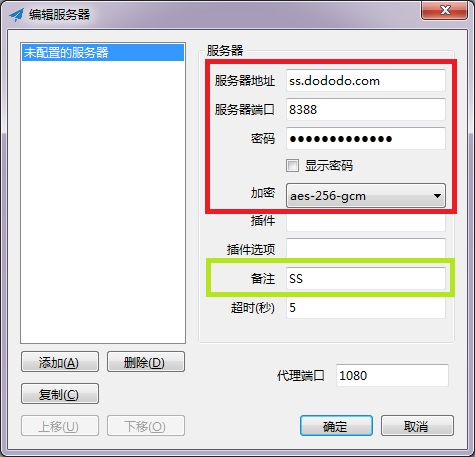
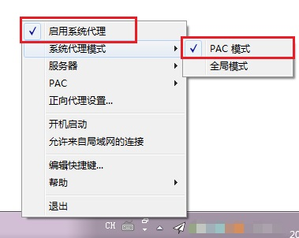

# shadowsock快速部署和使用 ([`官方文档`](https://shadowsocks.org/en/download/clients.html))

# 服务端部署（适合大部分linux环境）

```
# 下载

wget https://raw.githubusercontent.com/memorylorry/ShellTools/master/shadowsock/PORT_VAL

wget https://raw.githubusercontent.com/memorylorry/ShellTools/master/shadowsock/ss.sh

wget https://raw.githubusercontent.com/memorylorry/ShellTools/master/shadowsock/servercfg.json

# 更改权限

chmod +x ss.sh

# 安装并启动

./ss.sh i

./ss.sh server start

```

# Linux客户端部署（请参考文件结构，配置信息）
```
# 下载

wget https://raw.githubusercontent.com/memorylorry/ShellTools/master/shadowsock/PORT_VAL

wget https://raw.githubusercontent.com/memorylorry/ShellTools/master/shadowsock/ss.sh

# 更改权限

chmod +x ss.sh

# 安装并启动

./ss.sh i

./ss.sh client start
```

# Window客户端使用
1. [下载小飞机]('https://github.com/shadowsocks/shadowsocks-windows/releases/download/4.1.10.0/Shadowsocks-4.1.10.0.zip')，并启动，你将会看到如下界面；并按照如下配置IP、密码、加密方式。



2. 启动代理。



    按照如上图的方式启动代理，我们就能访问其它网站了。

    不过这里要强调一点，除非特殊需要，务必使用PAC模式！！！

    全局模式相当于所有流量都经过代理，国内网站都使用代理的话不是什么好事。不紧速度慢，而且容易暴露服务器。


3. 自行查看是否能访问Google。

# Mac客户端使用
由于目前没有该类机器，以及系统内存不够，不支持虚拟机测试，[请自行参考该仓库使用](https://github.com/shadowsocks/ShadowsocksX-NG)

# 文件结构
1. ss.sh  管理脚本，含IP、加密方式等信息
2. PORT_VAL 支持自动增长的端口值存放位置
3. servercfg.json 默认的多用户账户模板